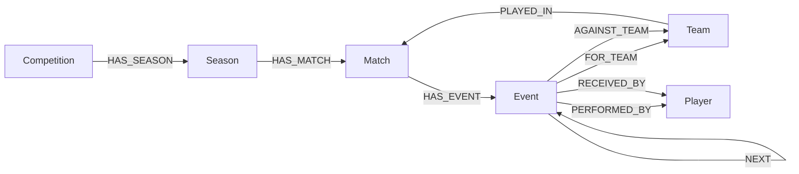

# Football Analyst Knowledge Graph

This project builds a Neo4j football knowledge graph plus a LangGraph analyst agent for event-driven football analysis.

The demo uses public [StatsBomb open-data](https://github.com/statsbomb/open-data) from historical FIFA World Cup matches to explore a deliberately lightweight question:

> If England were preparing for Mexico, what event patterns matter more than individual historical players?

The key takeaway is intentionally broader than football: knowledge graphs make relationships queryable. In enterprise AI, that means a better intelligence layer for connected context, provenance and reasoning. In football, it means moving from isolated actions to sequences: passes, carries, receipts, shots, xG, zones and possession chains.

## Demo Outputs

The generated analysis pack is in `outputs/statsbomb-england-mexico/`.

Start here:

- `event-patterns.html` - event-driven route and vulnerability summary.
- `mexico-vulnerability-heatmap.html` - where Mexico historically conceded shot value.
- `shot-map.html` - shot locations for England and Mexico.
- `pitch-map.html` - ordered possession chains into high-xG shots.
- `graph-overview.html` - loaded graph inventory.
- `linkedin-post.md` - draft post text.

Current loaded sample used for the demo:

- 66,939 events
- 20 matches
- 324 players
- 19 teams
- Public historical World Cup data, not paid/live 2026 data

The original plan had the right instinct, but it skipped the hardest part: the graph needs an ingestion pipeline and a stable schema before an LLM can query it reliably. This build separates those layers:

- `football_analyst.ingest` loads fixtures and event data.
- `football_analyst.schema` creates Neo4j constraints and indexes.
- `football_analyst.queries` stores known-good tactical Cypher for high-value football questions.
- `football_analyst.agent` wraps those queries in a LangGraph analyst workflow.

## Data Reality Check

Fixture and score data for the 2026 World Cup can be ingested from Football-Data.org's World Cup competition endpoint if you add an API key. Rich event data such as passes, carries, shots, xG and possession chains usually comes from event-data providers. The included event loader accepts StatsBomb-style JSON, so you can use paid/live event exports now or public historical StatsBomb open data for development.

## Setup

```powershell
cd "C:\Users\IsaacSwanton\OneDrive - kyndryl\Documents\New project\football-analyst"
python -m venv .venv
.\.venv\Scripts\Activate.ps1
pip install -r requirements.txt
Copy-Item .env.example .env
```

Edit `.env` with your OpenAI and Neo4j AuraDB credentials.

## Neo4j AuraDB

Create a free AuraDB instance at `console.neo4j.io`, copy the generated password immediately, and put these values into `.env`:

```text
NEO4J_URI="neo4j+s://..."
NEO4J_USERNAME="neo4j"
NEO4J_PASSWORD="..."
NEO4J_DATABASE=""
```

Then initialise the database:

```powershell
python analyst.py init-db
```

## Load Data

Load the bundled sample event feed:

```powershell
python analyst.py sample
```

Load a StatsBomb-style event file:

```powershell
python analyst.py statsbomb data/raw/events/match.json --match-id wc-2026-001 --home-team Mexico --away-team Argentina
```

Load StatsBomb open-data directly from GitHub:

```powershell
python analyst.py statsbomb-open-competitions world cup
python analyst.py statsbomb-open-matches 43 106 --team England
python analyst.py statsbomb-open 43 106 --team England --limit 3
python analyst.py statsbomb-open 43 106 --team Mexico --limit 3
python analyst.py status
```

StatsBomb open-data is historical public data. It is excellent for proving the graph and visuals, but it is not a live 2026 World Cup feed unless those matches have been published in the repository.

If GitHub raw downloads fail behind corporate TLS inspection, prefer:

```text
STATSBOMB_OPEN_CA_BUNDLE="C:\path\to\company-root-ca.pem"
```

For a temporary local test only:

```text
STATSBOMB_OPEN_VERIFY_SSL="false"
```

Load World Cup fixtures from Football-Data.org:

```powershell
python analyst.py fixtures --season 2026
```

If your network uses corporate TLS inspection and the fixture command reports an SSL verification error, prefer setting:

```text
FOOTBALL_DATA_CA_BUNDLE="C:\path\to\company-root-ca.pem"
```

For a temporary local test only:

```text
FOOTBALL_DATA_VERIFY_SSL="false"
```

Check what is actually loaded:

```powershell
python analyst.py status
```

## Ask The Analyst

```powershell
python analyst.py ask --team Mexico --query "Find the passing sequences that most frequently lead to high-xG shots against them."
```

England vs Mexico matchup mode:

```powershell
python analyst.py ask --analysis-team England --team Mexico --query "Infer England's winning combos against Mexico and Mexico's vulnerabilities."
python analyst.py ask --analysis-team England --team Mexico --query "Where is Mexico vulnerable to high quality chances?"
```

The agent first maps common tactical questions to curated Cypher. For unfamiliar questions, it falls back to LLM-generated read-only Cypher and rejects write operations.

## Create Visuals

After loading data into Neo4j, generate shareable HTML analysis views:

```powershell
python analyst.py visuals --analysis-team England --team Mexico --output-dir outputs/england-mexico
```

Open these files in a browser:

- `outputs/england-mexico/pitch-map.html`
- `outputs/england-mexico/event-patterns.html`
- `outputs/england-mexico/shot-map.html`
- `outputs/england-mexico/mexico-vulnerability-heatmap.html`
- `outputs/england-mexico/england-chance-network.html`
- `outputs/england-mexico/player-combinations.html`
- `outputs/england-mexico/vulnerabilities.html`
- `outputs/england-mexico/graph-overview.html`
- `outputs/england-mexico/matchup-data.json`

For raw graph exploration, use Neo4j Browser and run:

```cypher
MATCH p=(m:Match)-[:HAS_EVENT]->(e:Event)-[:FOR_TEAM|AGAINST_TEAM|PERFORMED_BY|RECEIVED_BY]-()
RETURN p
LIMIT 80
```

For the schema shape:

```cypher
MATCH p=(a)-[r]->(b)
RETURN p
LIMIT 120
```

## Matchup Analysis Pivot

For England vs Mexico, ingest:

- England's most recent pre-World Cup matches and current World Cup matches.
- Mexico's most recent pre-World Cup matches and current World Cup matches.
- Event-level actions with xG, xT or equivalent value, coordinates, possession/sequence IDs, pressure, and phase of play.

The key questions now supported are:

- Which England pass/carry/dribble combinations repeatedly create high-xG shots?
- Which combinations have opponents used to create high-xG shots against Mexico?
- Which lanes and depths produce the highest xG against Mexico?
- Do England's strengths overlap with Mexico's conceded-chance profile?

In Impect terms, preserve fields such as action type, team, player, receiver, coordinates, possession/attack ID, xG, xT, Packing, pressure and phase of play when transforming exports into the graph.

## Graph Model



## Useful Commands

```powershell
pytest
python analyst.py --help
python analyst.py ask --team Mexico
```

## Source Notes

- StatsBomb open data: https://github.com/statsbomb/open-data
- Football-Data.org API docs: https://www.football-data.org/documentation/api
- Football-Data.org coverage: https://www.football-data.org/coverage

## GitHub Safety

Do not upload `.env`, `.venv`, `.pytest_cache`, or raw provider data containing licensed/private material. This repository includes `.env.example` only.
